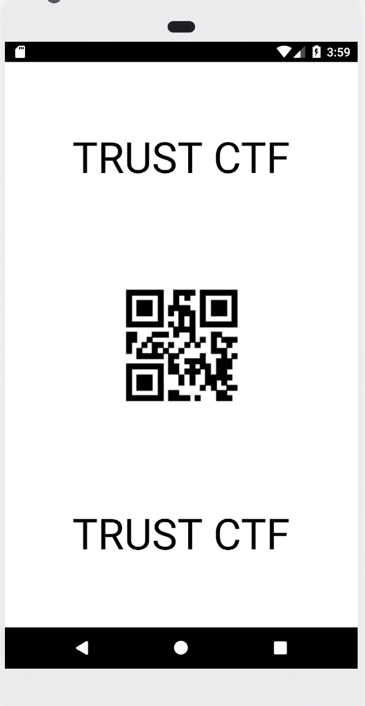
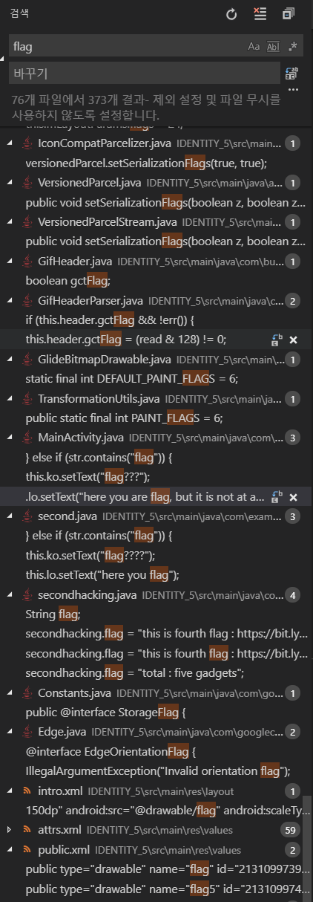
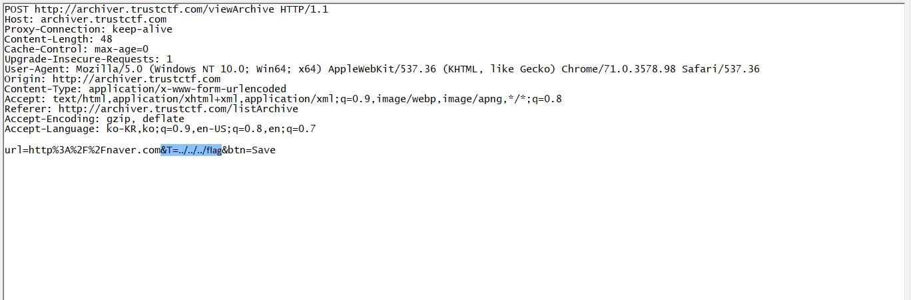

# trust ctf

## REV

### MESS

말 그대로 메스 인것 같다.  
어셈블리 분석을 하려고 했는데 브포를 잡으면서 쭉 진행하다 보니깐 메모리상에 그대로 키 값이 들어 있고
그 위치는 0x34A000이다.

**PW : S3CRe7PA5sW0rD**

콘솔창에 그대로 입력하면 된다.

**Flag : TRUST{bBRWt>UHD?5wQ}**

### HelloWorldS

말 그대로 HelloWorld 프로그램이 정말 많이 있다.  
dukup11ch1이 만든 프로그램 8개와 다른 사람이 만든 HelloWorld프로그램을 구문하는 문제로 보인다.

문제힌트에 Yara rule을 작성하라고 되어있고, 파이썬 코드를 보아도 yara라는 모듈을 임포트 하게 되어있다.  
넷캣 접속을 하면 이 파이썬 코드가 실행되는 것 같다.

그럼 우선 자신의 파일과 다른 사람의 파일을 분리해야한다.

우선 출력값만 보면 내파일은 `Hello, World!` 처럼 쉼표가 있으니 이 문자열을 그대로 조건문에 넣었다. 

```
rule test {
	strings:
		$str = "Hello, World!"
	condition:
		$str
}

``` 
1 2 3 4 5 6 8 12 15 16 통과

그리고 11, 13, 14파일은 Hello World가 옆에 아무 문자 없이 들어가 있으니 다음과 같이 작성해 준다.

```
rule test {
	strings:
		$str = "Hello, World!"
		$str1 = "Hello World" fullword 
	condition:
		$str or $str1
}

``` 
1 4 6 8 11 12 13 15 16 통과

이를 바탕으로 해서 디버거로 파일을 연 뒤 스트링 참조를 모두 찾아서 해결했다.

final rule : 
```
rule test {
	strings:
		$str = "Hello, World!" nocase
		$str1 = "Hello World" fullword 
		$str2 = "Hello world"
		$str3 = "Hello World!\n"
		$str4 = "Hello World!"
		$str5 = "Hello World~\n"
		$str6 = "%c"
		$str7 = "Hello World!!"
		$str8 = "pause"
	condition:
		($str or $str1 or $str2 or $str6) and not $str3 and not $str4 and not $str5 and not $str7 and not ($str6 and $str8)
}
```

**Flag : TRUST{I9n0re_PDB_R1CH_I'm_s0rry_TT}**  
Ignore pdb rich i'm sorry TT  
(pdb가 뭔지 찾아봤는데 프로그램 데이터 베이스?인가...)

## PWN
포너블은 지식이 너무 없어서 풀지 못했다. ㅠ

## MISC

### MIC CHECK


췌ㅔㅔㄱ

**Flag : TRUST{Welcome_CTF_Have_FUN!}**  
Welcome ~~to~~ CTF, Have FUN!


### Easy Taebo

@==(^0^)@  
@(^0^)==@

넷캣으로 연결하게 되어있다.
간단하게 pwntools를 이용해서 익스플로잇을 짜면 된다.

```py
from pwn import *
import re

list = {'left_jab' : '@==(^0^)@',
    'left_mid_jab' : '@=(^0^)@',
    'mid_jab' : '@(^0^)@',
    'right_mid_jab' : '@(^0^)=@',
    'right_jab' : '@(^0^)==@',
    'left_hook' : '@(^0^)@==',
    'right_hook' : '==@(^0^)@',
    'left_speedball' : '@@@(^0^)',
    'right_speedball' : '(^0^)@@@',
    'left_kick' : '@||(^0^)==@',
    'mid_kick' : '@==(^||^)==@',
    'right_kick' : '@==(^0^)||@'}
```
리스트를 만들어 주고
```py

cn = remote("server.trustctf.com", 44923)

while True:
    prob = cn.recvline()
    print prob
    if prob[0] != "T" or prob[6] == "i":
        continue
    prob = re.sub("Taebo \d* : ", "", prob)
    prob = prob.replace(' >>', '')
    log.info('PROBLEM : ' + prob)
    ans = ""
    a = prob[:-2].split(" + ")
    for b in a:
        ans += list[b] + " "
    log.info('ANSWER : ' + str(ans))
    cn.sendline(ans)
    print '\n'
```
접속해서 해결.

**Flag : TRUST{w0w_y0u_9o7_4_w0nd3rfu1_b0dy_lik3_m3}**  
wow you got a wonderful body like me

### IDENTITY_5

identity_5.apk파일을 다운로드하면 일단 실행하라고 되어있다.

적당히 AVD에다가 넣고 돌리면 QR코드가 하나 등장한다  
하지만 이것은 빙산의 일각.



그 다음 화면에서 남한어 번역기 뭐라고 뜨는데 어딜 클릭할지를 몰라서 그냥 디컴파일 시켰다.

jadx에 넣고 디컴시키면 되게 많은 것이 있는데 전부다 저장시킨 다음에 Visual Studio Code로 불러와서
Visual Studio Code의 검색기능을 활용했다.



그러니 `MainActivity.java`와 `secondhacking.java`에 `bit.ly` 주소가 적혀있다. 이렇게 2번 4번이 있고
apk파일 안에 res/drawable로 들어가면 시작화면에 있던 flag.jpg파일 (hex를 읽어보니 확장자는 .jpg가 아니라 .png가 되어야 한다.) 이 있고, 바이너리에 빠진 flag3파일이 나중에 추가로 공개 되었다.

차례대로 QR코드를 읽으면 
+ TRUST{
+ Th1s_1s_
+ fl@g_@nd
+ r0id_@dd_Qr
+ c0d3}   
가 된다.
쭉 이으면 

**Flag : TRUST{Th1s_1s_fl@g_@ndr0id_@dd_Qrc0d3}**  
This is flag android add(and?) qrcode


### Starcraft2

운 좋게도 스타를 좋아하는 유저라서 스타2가 깔려 있다
그래서 10분 만에 풀어 낼 수 있었다.

그냥 파일을 맵 에디터로 열면 미니맵에 플래그가 쓰여있다.

~~(어머나 라업을 써야하는데 셧다운제 때문에 맵 에디터를 쓰질 못한다... 아뿔싸)~~

**Flag : TRUST{FUN}**


### RSA1

RSA 암호문 : 1649729212658550722856763813613372  
암호화에 사용된 소수 1 : 36465956589847261  
암호화에 사용된 소수 2 : 46496464168468673  
복호화 키 : 1275312736838027047985273062147003

문제에는 이렇게 쓰여있다.  
이 문제를 풀기 위해서 공부를 좀 했는데, 우선

C = 암호문  
p = 소수1  
q = 소수2  
d = 개인키(복호화 키)
n = $p × q$

이렇게 하면
$C=1649729212658550722856763813613372$  
$p = 36465956589847261$  
$q = 46496464168468673$  
$d = 1275312736838027047985273062147003$
가 나온다.

복호화 식은 $C^d \: mod \: n$이 되므로 계산해 주면 되는데...
문제는 $C^d$를 계산하기에는 수가 너무 커져 버린다. 그래서 뭔갈 좀 찾아 봤는데 나오는 것이 $a^b\%n$에 관한 글이었다. 

```py
def powermod4(a, b, n):
    if b == 1:
        return a % n
    r = powermod4(a, b / 2, n)
    r = r * r % n
    if (b & 1) == 1:
        r = r * a % n
    return r
```
_from [this](https://helloacm.com/compute-powermod-abn/) site_

```py
powermod4(C, d, n)
```
을 해주니 정상적으로 나머지가 잘 나왔다.

(python3에서 제한이 걸려서 안되니깐 python2로 실행했다.)

**나머지 : 65838295874878759585488995896489**

이제 이 나머지들을 두자리씩 끊어서 ascii로 고치면 된다.

**Flag : ASR_W0NK_U0Y_Y@Y**  
ASR WONK UOY YAY (음? 뒤집으면 된다.)  
YAY YOU KNOW RSA


## WEB

### Archive
~~사실 웹문제를 풀게 될 줄은 몰랐다..~~

힌트에 flag는 /flag에 있다고 되어있다.  
아마 루트 폴더에 들어있는것 같다.

저 웹페이지를 들어가니깐 아카이빙을 할 수 있는 시스템 처럼 보였다. 아무 사이트를 입력하니깐 잘 아카이빙이 되었다.

처음에는 `http://127.0.0.1/../../../flag`처럼 했었는데, 지금은 될리가 있겠나 싶다.

viewArchive를 POST하는 쪽에서 open이라는 함수가 보인다.  
여기서 어떻게 잘하면 루트 폴더의 flag를 읽을 수 있을 것 처럼 보인다.

우선 hashed는 util.py파일을 봤을 때 md5를 하고 앞 뒤에 prefix가 붙어서 여기서는 할 수 있는게 없다.

그래서 T값을 어찌 잘 조작하면 될 것 같았다.



응답에는 플래그가 적혀 있었다.

**Flag : TRUST{Easy_Local_file_traversal_N3xt_t1me_i_1l_us3_DB..:(}**  
Easy local file traversal next time i'll use db  
(DB를 써야한다는 교훈까지 주는 좋은 문제였다.)


# After CTF

## REV

### 나를크랙!

크랙미인데, PE Scan을 하면 `ConfuserEx v0.3 - 1.0 [ v1.0.0 - Preset : Maximum ]  (C) Ki 2014  - https://yck1509.github.io/ConfuserEx`이렇게 뜬다. ConfuserEx가 뭔가하고 찾아봤더니 정말 어려웠다.

사실 알고보면 크랙미 버튼을 클릭하고 얼럿창에서 확인을 누르면
클립보드에 Flag가 복사되는 것이었다...
(나중에 언패킹도 시도해 봐야겠다.)

**Flag : TRUST{W0w_You_F!ind_IT}**


## PWN
역시나...

## MISC

RSA2는 접근하기 어렵드라..

## WEB JJcode

flag가 DB속에 있다니 SQLi일것 같은데
/read.php에서 잘 해보면 될 것 같다.